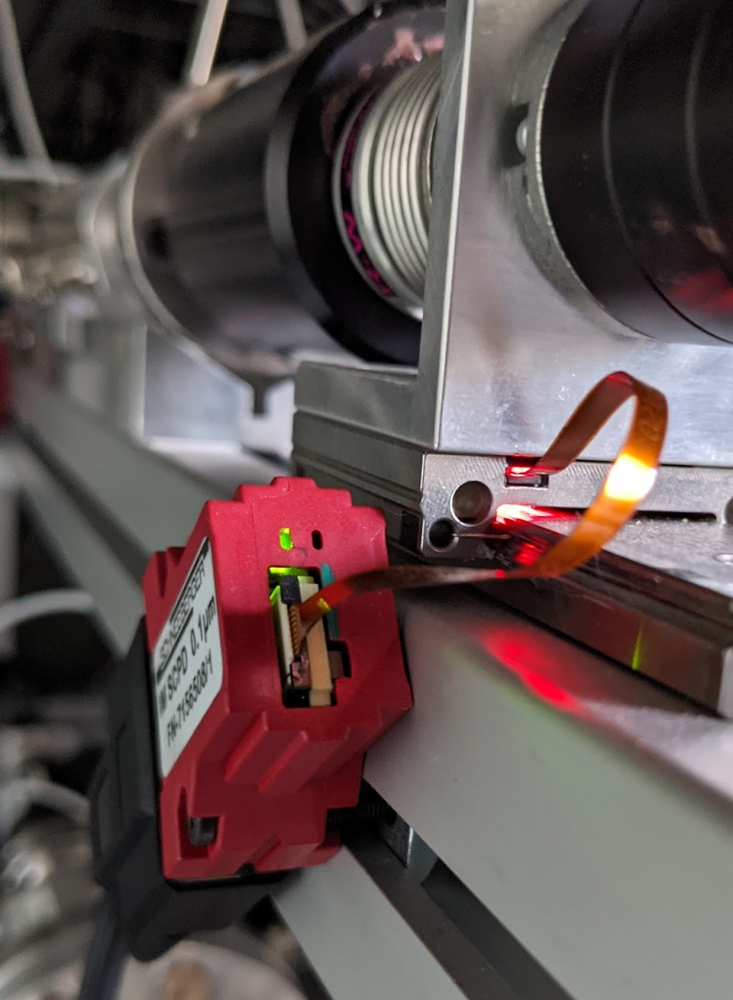
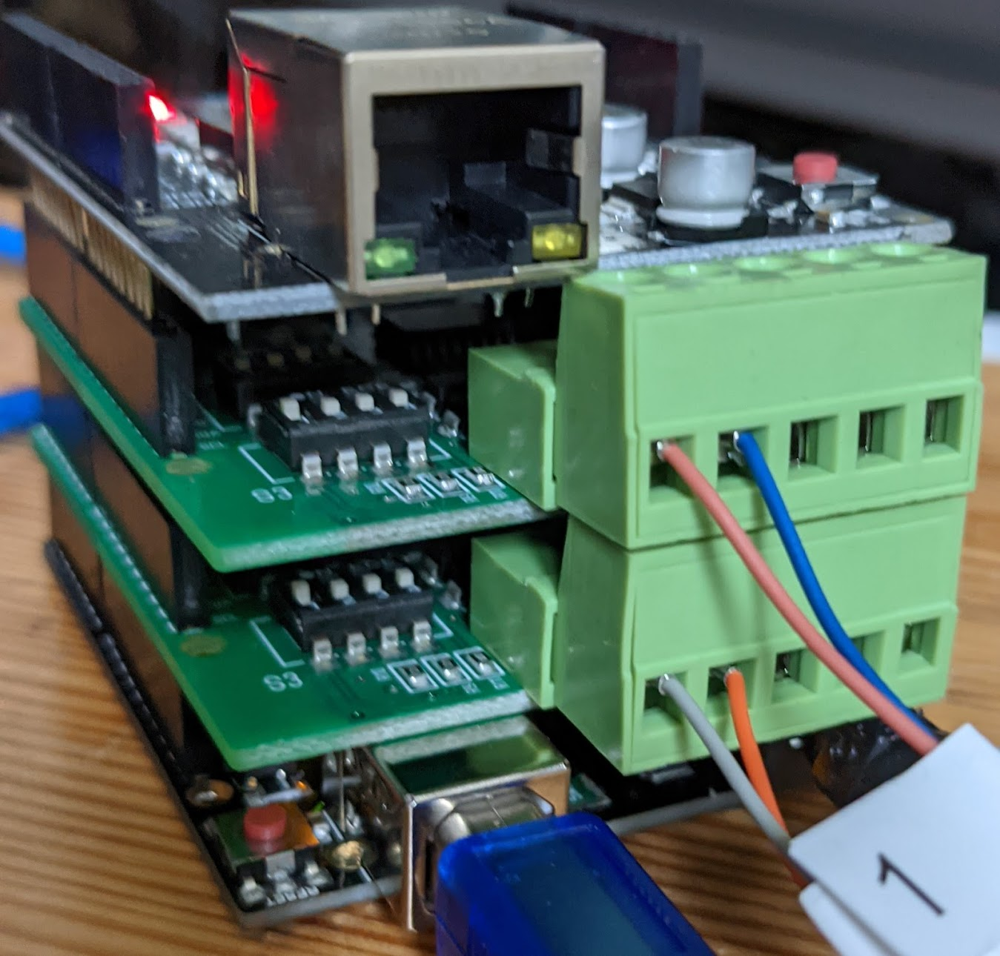

```

                             ┌──────────────────────┐  ┌────────┐
                             │                      │  │        │
                             │ MINISCALE            │  │ POWER  │
                             │                      │  │        │
                             │ 1  2  3    6  7  8   │  │        │
                             │ A- 0V B-   A+ 5V B+  │  │  0V 5V │
                             └─┬──┬──┬────┬──┬──┬───┘  └───┬──┬─┘
 ┌────────────────────────┐    │  │  │    │  │  │          │  │
 │ RS422-Shield           │    │  └──┼────┼──┼──┼──────────┤  │
 │                   GND  │    │     │    │  │  │          │  │
 │                        │    │     │    │  └──┼──────────┼──┤
 │                     Y  │    │     │    │     │          │  │
 │                        │    │     │    │     │          │  │
 │                     Z  │    │     │    │     │          │  │
 │                        │    │     │    │     │          │  │
 │                     A  ├────┼─────┼────┼─────┘          │  │
 │  J3: Port-RX           │    │     │    │                │  │
 │                     B  ├────┼─────┘    │                │  │
 │                        │    │          │                │  │
 ├────────────────────────┤    │          │                │  │
 ├────────────────────────┤    │          │                │  │
 │  RS422-Shield          │    │          │                │  │
 │                   GND  │    │          │                │  │
 │                        │    │          │                │  │
 │                     Y  │    │          │                │  │
 │                        │    │          │                │  │
 │                     Z  │    │          │                │  │
 │                        │    │          │                │  │
 │                     A  ├────┼──────────┘                │  │
 │  J2: Port-RX           │    │                           │  │
 │                     B  ├────┘                           │  │
 │                        │                                │  │
 ├────────────────────────┤                                │  │
 ├────────────────────────┤                                │  │
 │ Arduino UNO       GND  ├────────────────────────────────┘  │
 │                        │                                   │
 │                    5V  ├───────────────────────────────────┘
 └────────────────────────┘
```

## RS422 Shield

See docs folder for manual.

Switch settings:

S1: 
1:on
2:off
3:off
4:off

S2: 
1:off
2:off
3:on
4:on

S3: 
1:on
2:off
3:off
4:off




